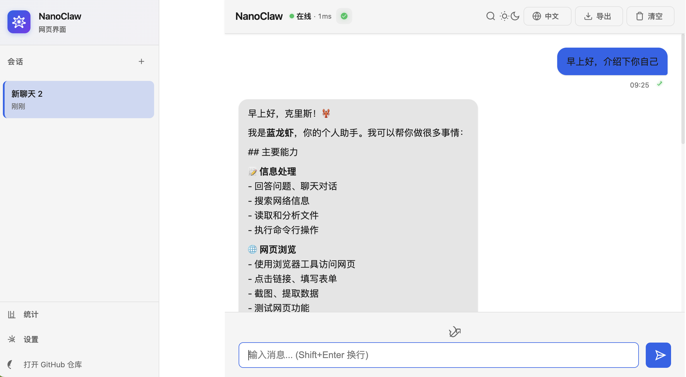

# NanoClaw Web UI

A modern, responsive web-based chat interface for AI assistants. Built with Express, WebSocket, and vanilla JavaScript.



## Features

- 🌐 **Real-time Communication** - WebSocket-based instant messaging
- 🔐 **Optional Authentication** - Token-based access control
- 📱 **Mobile Responsive** - Works seamlessly on desktop and mobile
- 🎨 **Dark/Light Theme** - Easy on the eyes, modern design
- 💬 **Markdown Support** - Rich text formatting for bot responses
- 🔄 **Auto-Reconnect** - Automatically reconnects on connection loss
- 🌍 **i18n Support** - English and Chinese languages
- 🔍 **Search Messages** - Quick message search (Ctrl+K)
- 📎 **File Upload** - Drag and drop file support
- 📊 **Usage Statistics** - Track message activity

## Compatibility

| Web UI Version | NanoClaw Version | Status |
|----------------|------------------|--------|
| v1.2.x | v1.2.1+ | ✅ Compatible |
| v1.1.x | v1.1.x | ✅ Compatible |

> **Note:** Web UI v1.2.x requires NanoClaw v1.2.1 or later for the new channel registry system.

## Quick Start

### Installation

```bash
npm install nanoclaw-web-ui
```

### Basic Usage

```javascript
import WebUIServer from 'nanoclaw-web-ui';

const server = new WebUIServer({
  port: 3000,
  assistantName: 'MyAssistant',
  onMessage: async (message) => {
    console.log('Received:', message.content);
    // Process message and send response
    server.sendToSession(message.chatJid.replace('web:', ''), {
      type: 'message',
      from: 'assistant',
      content: 'Hello! You said: ' + message.content,
      timestamp: new Date().toISOString(),
    });
  },
});

await server.start();
```

### With Authentication

```javascript
const server = new WebUIServer({
  port: 3000,
  authToken: process.env.SECRET_TOKEN,
  onAuthenticate: (sessionId) => {
    return true; // or check against your user database
  },
});
```

## Configuration

| Option | Type | Default | Description |
|--------|------|---------|-------------|
| `port` | number | `3000` | Port to listen on |
| `host` | string | `"localhost"` | Host to bind to (default: localhost for security) |
| `authToken` | string | `undefined` | Optional auth token |
| `assistantName` | string | `"NanoClaw"` | Bot name displayed in UI |
| `staticPath` | string | `"../public"` | Path to static files |
| `onMessage` | function | - | Callback for incoming messages |
| `onAuthenticate` | function | - | Custom auth callback |

## Environment Variables

```bash
WEB_UI_PORT=3000           # Port to listen on
WEB_UI_HOST=localhost      # Host to bind to (default: localhost - only accessible from this machine)
WEB_UI_AUTH_TOKEN=secret   # Optional auth token
ASSISTANT_NAME=MyBot       # Bot name
```

### Security Note

By default, the Web UI binds to `localhost` and is only accessible from the machine it's running on. To expose it externally:

⚠️ **Warning**: Only bind to `0.0.0.0` if you have proper authentication in place!

```bash
# Allow external access (use with caution!)
WEB_UI_HOST=0.0.0.0
WEB_UI_AUTH_TOKEN=your-strong-secret-token
```

## API Endpoints

### GET `/api/health`
Health check endpoint.

### POST `/api/broadcast`
Send message to all connected sessions.

### POST `/api/send`
Send message to specific session.

## WebSocket Protocol

### Client → Server

**Connect & Authenticate:**
```json
{
  "type": "auth",
  "token": "optional-token"
}
```

**Send Message:**
```json
{
  "type": "message",
  "content": "Hello bot!"
}
```

### Server → Client

**Connected:**
```json
{
  "type": "connected",
  "sessionId": "web_1234567890_abc123",
  "assistant": "NanoClaw"
}
```

**Message:**
```json
{
  "type": "message",
  "from": "assistant",
  "content": "Hello!",
  "timestamp": "2024-03-02T10:00:00.000Z"
}
```

## Deployment

### Docker

```bash
docker build -t nanoclaw-web-ui .
docker run -p 3000:3000 -e WEB_UI_AUTH_TOKEN=your-secret nanoclaw-web-ui
```

### Docker Compose

```yaml
version: '3.8'
services:
  web-ui:
    image: nanoclaw-web-ui:latest
    ports:
      - "3000:3000"
    environment:
      - WEB_UI_AUTH_TOKEN=your-secret-token
    restart: unless-stopped
```

## Documentation

- **[中文文档](README_zh-hans.md)** - Chinese README
- **[Contributing Guide](CONTRIBUTING.md)** - Development setup and contribution guidelines
- **[NanoClaw Project](https://github.com/qwibitai/nanoclaw)** - Core AI assistant framework

## License

MIT License - see [LICENSE](LICENSE) for details.

## Links

- **Repository:** [https://github.com/WhosClaw/nanoclaw-web-ui](https://github.com/WhosClaw/nanoclaw-web-ui)
- **Issues:** [GitHub Issues](https://github.com/WhosClaw/nanoclaw-web-ui/issues)
- **NanoClaw:** [https://github.com/qwibitai/nanoclaw](https://github.com/qwibitai/nanoclaw)
